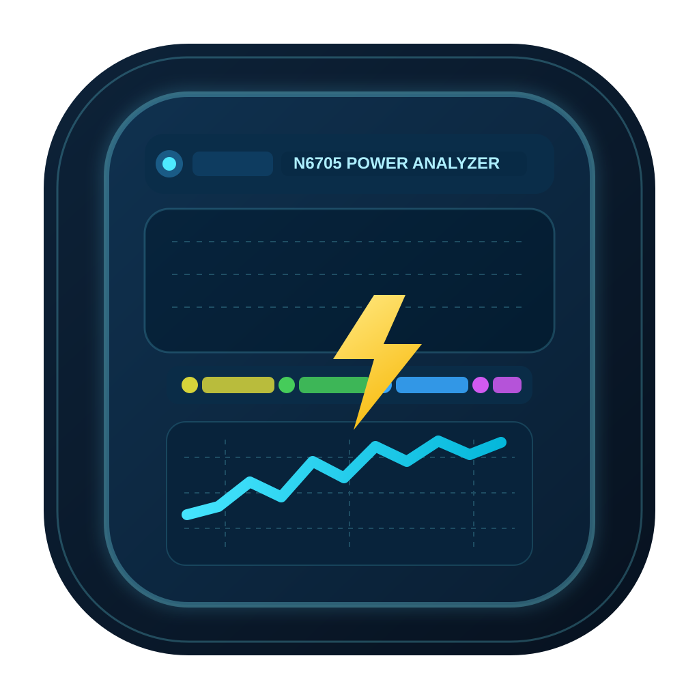
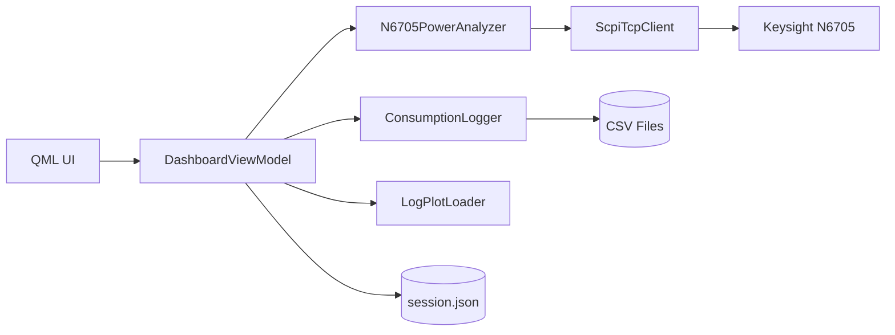
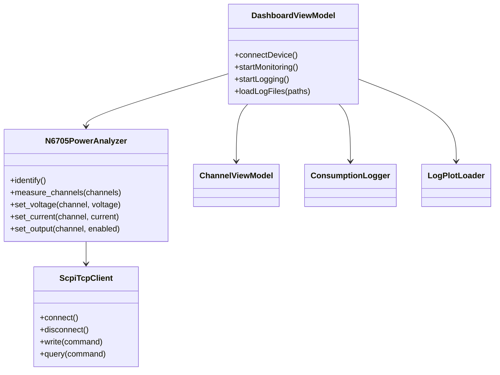

# N6705 Power Console

Professional desktop application for controlling and monitoring a Keysight N6705 power analyzer over SCPI/TCP, with a modern Qt/QML interface and a Python MVVM backend.


<p align="center">
  
</p>

## Key Features

- Remote Ethernet connection to N6705 (`host`, `port`, `timeout`)
- Instrument identification via `*IDN?`
- Per-channel control (CH1..CH4):
  - Voltage setpoint (`VOLT`)
  - Current limit (`CURR`)
  - Output state (`OUTP ON/OFF`)
- Real-time views:
  - Meter View
  - Scope View (V/I/P + Ah/Wh trends)
  - Data Logger (channel status and event stream)
  - Log Plot (multi-file historical analysis)
- CSV logging with channel accumulators (`charge_ah`, `energy_wh`)
- PNG export for historical charts
- Session persistence in JSON
- Modular architecture (MVVM + Ports/Adapters)

## Technology Stack

- Python 3.10+
- PySide6 / QtQuick / QtQuick.Controls
- QML for presentation
- SCPI over TCP for instrument communication

## High-Level Architecture



## UML Class View



## Repository Layout

- `app.py`: application entrypoint
- `n6705_ui/qml_main.py`: Qt/QML bootstrap
- `n6705_ui/communication/scpi_client.py`: SCPI TCP client
- `n6705_ui/device/n6705.py`: high-level device adapter
- `n6705_ui/presentation/viewmodels/`: MVVM orchestration
- `n6705_ui/presentation/qml/`: UI views/components
- `n6705_ui/logging/`: CSV logging and historical loader
- `tests/`: integration and service tests
- `docs/doxygen/`: Doxygen pages and UML assets

## Quick Start

```bash
python -m venv .venv
# Linux/macOS
source .venv/bin/activate
# Windows PowerShell
.\.venv\Scripts\Activate.ps1
pip install -r requirements.txt
python app.py
```

## Running Tests

```bash
python -m unittest discover -s tests -v
```

## Windows Installer (EXE Setup)

This project includes a production-style Windows packaging pipeline:

- `PyInstaller` builds a standalone GUI executable bundle
- `Inno Setup` builds the installable `.exe` with:
  - Start Menu and optional Desktop shortcut
  - Uninstaller entry
  - per-user installation (`%LOCALAPPDATA%\Programs\N6705 Power Console`)
  - `N6705_UI_HOME` environment variable

### Prerequisites

- Windows 10/11 x64
- Python 3.10+ available as `python`
- Inno Setup 6 (compiler `iscc.exe` in `PATH`)

### Build Installer

```powershell
.\packaging\windows\build_installer.cmd -AppVersion 1.0.0
```

If you prefer the PowerShell script directly:

```powershell
powershell -NoProfile -ExecutionPolicy Bypass -File .\packaging\windows\build_installer.ps1 -AppVersion 1.0.0
```

Output:

- App bundle: `dist/windows/app/N6705PowerConsole/`
- Installer EXE: `dist/windows/installer/n6705-power-console-<version>-setup.exe`

Optional flags:

- `-SkipTests` skip unit tests before packaging
- `-SkipInstaller` build only app bundle (no installer)
- `-Clean` remove previous `build/windows` and `dist/windows` outputs

## Doxygen Documentation

### Prerequisites

- Doxygen
- Graphviz (`dot`) for generated graphs
- Optional: PlantUML if you want to render `.puml` assets externally

### Build Documentation

```bash
doxygen Doxyfile
```

Output is generated under `docs/build/html`.

## Additional Documentation

- Architecture deep dive: `ARCHITECTURE.md`
- Detailed user tutorial: `USER_GUIDE.md`
- Doxygen pages: `docs/doxygen/mainpage.md`
- UML sources: `docs/doxygen/uml/`

## License / Notes

This repository currently focuses on engineering and instrumentation workflow. Add your preferred project license if distribution is planned.

## Signature

Author: Mouhsine Kassimi Farhaoui  
Mail: mouhsine98@gmail.com
