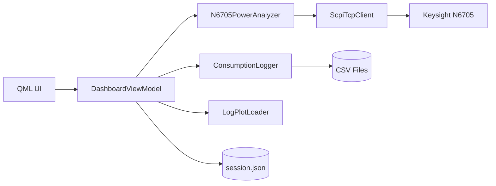
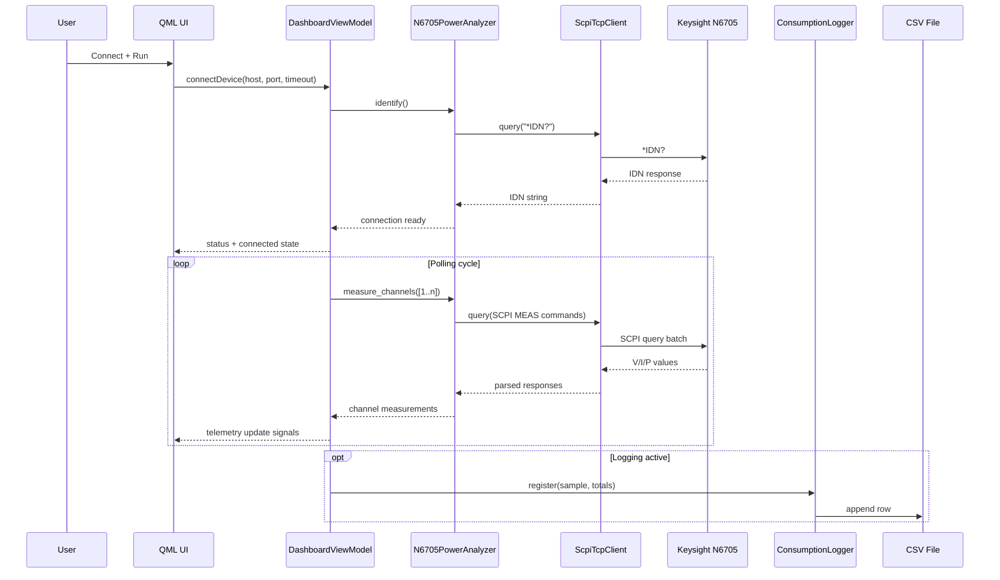

# N6705 Power Console

[](#technology-stack)
[](#windows-installer-exe-setup)
[](#project-status)
[](LICENSE)

Professional cross-platform desktop application for controlling and monitoring a Keysight N6705 power analyzer over SCPI/TCP, built with Qt/QML (PySide6) and a Python MVVM backend.

<p align="center">
  
</p>

## Table of Contents

- [Core Capabilities](#core-capabilities)
- [Technology Stack](#technology-stack)
- [Architecture Overview](#architecture-overview)
- [Runtime Sequence](#runtime-sequence)
- [Repository Structure](#repository-structure)
- [Dependencies](#dependencies)
- [Run From Source](#run-from-source)
- [Windows Installer (EXE Setup)](#windows-installer-exe-setup)
- [Documentation](#documentation)
- [Testing](#testing)
- [Troubleshooting](#troubleshooting)
- [Project Status](#project-status)
- [License](#license)

## Core Capabilities

- Remote Ethernet connection to N6705 (`host`, `port`, `timeout`)
- Instrument identification via `*IDN?`
- Per-channel control (CH1..CH4):
  - Voltage setpoint (`VOLT`)
  - Current limit (`CURR`)
  - Output state (`OUTP ON/OFF`)
- Real-time operation modes:
  - Meter View
  - Scope View (V/I/P + Ah/Wh trends)
  - Data Logger (channel status + event stream)
  - Log Plot (historical multi-file analysis)
- CSV logging with integrated channel accumulators (`charge_ah`, `energy_wh`)
- PNG export for historical chart panels
- Session persistence in JSON
- Light/Dark theme switch in top bar

## Technology Stack

- Python 3.10+
- PySide6 / QtQuick / QtQuick.Controls (Material style)
- QML UI + Python ViewModels (MVVM)
- SCPI over TCP for instrument communication

## Architecture Overview



### Main Roles

- `ScpiTcpClient`: TCP connection lifecycle and SCPI read/write/query primitives
- `N6705PowerAnalyzer`: instrument-level operations (setpoints, outputs, measurements)
- `DashboardViewModel`: UI orchestration, connection, polling, logging, session state
- `ConsumptionLogger`: deterministic CSV writing + Ah/Wh accumulation
- `LogPlotLoader`: historical load, validation, decimation, chart series payload

## Runtime Sequence



## Repository Structure

- `app.py`: application entrypoint
- `n6705_ui/qml_main.py`: Qt/QML bootstrap
- `n6705_ui/communication/scpi_client.py`: SCPI TCP client
- `n6705_ui/device/n6705.py`: N6705 device adapter
- `n6705_ui/presentation/viewmodels/`: MVVM orchestration layer
- `n6705_ui/presentation/qml/`: QML UI views/components
- `n6705_ui/logging/`: CSV logger + historical loader
- `tests/`: integration and service tests
- `packaging/windows/`: Windows build and installer scripts
- `docs/doxygen/`: documentation pages and UML assets

## Dependencies

### Runtime Dependencies

Defined in `requirements.txt`:

- `PySide6>=6.8,<7`

### Build Dependencies (Windows Installer Pipeline)

Installed automatically by `packaging/windows/build_installer.ps1`:

- `pyinstaller`
- `pyinstaller-hooks-contrib`
- `pillow`

System dependency:

- Inno Setup 6 (`ISCC.exe`)

## Run From Source

### 1) Create Virtual Environment

```bash
python -m venv .venv
```

### 2) Activate Environment

Linux/macOS:

```bash
source .venv/bin/activate
```

Windows PowerShell:

```powershell
.\.venv\Scripts\Activate.ps1
```

### 3) Install Dependencies

```bash
pip install -r requirements.txt
```

### 4) Launch

```bash
python app.py
```

## Windows Installer (EXE Setup)

The packaging pipeline generates:

1. Standalone application bundle (`PyInstaller`)
2. Installable setup executable (`Inno Setup`)

### Prerequisites

- Windows 10/11 x64
- Python 3.10+ on the build machine
- Inno Setup 6 installed

### Build Command

Preferred command (works even if PowerShell script policy is restrictive):

```powershell
.\packaging\windows\build_installer.cmd -AppVersion 1.0.0
```

Alternative direct command:

```powershell
powershell -NoProfile -ExecutionPolicy Bypass -File .\packaging\windows\build_installer.ps1 -AppVersion 1.0.0
```

### Output Artifacts

- App bundle: `dist/windows/app/N6705PowerConsole/`
- Installer: `dist/windows/installer/n6705-power-console-<version>-setup.exe`

### Installer Behavior

- Per-user install path: `%LOCALAPPDATA%\Programs\N6705 Power Console`
- Start Menu shortcut + optional Desktop shortcut
- Uninstaller registration
- User environment variable: `N6705_UI_HOME`

### Build Flags

- `-SkipTests`: skip unit tests before packaging
- `-SkipInstaller`: build app bundle only
- `-Clean`: remove previous build outputs

## Documentation

- Architecture reference: `ARCHITECTURE.md`
- User guide: `USER_GUIDE.md`
- Doxygen main page: `docs/doxygen/mainpage.md`
- Doxygen tutorial: `docs/doxygen/tutorial.md`
- UML/diagram assets: `docs/doxygen/uml/`

Generate Doxygen HTML:

```bash
doxygen Doxyfile
```

Output: `docs/build/html/`

## Testing

Run test suite:

```bash
python -m unittest discover -s tests -v
```

## Troubleshooting

- `PySide6 is not installed`:
  - install dependencies with `pip install -r requirements.txt`
- `iscc.exe not found` during installer build:
  - install Inno Setup 6, or ensure `ISCC.exe` is reachable
- QML module/plugin load issues on Windows:
  - run with the same interpreter where dependencies were installed
- Connection fails:
  - verify instrument IP/route, firewall, and TCP 5025

## Project Status

Active development. Core workflows are stable and being iterated with UI, packaging, and documentation improvements.

## License

This project is licensed under the MIT License. See `LICENSE`.

## Signature

Author: Mouhsine Kassimi Farhaoui  
Mail: mouhsine98@gmail.com
