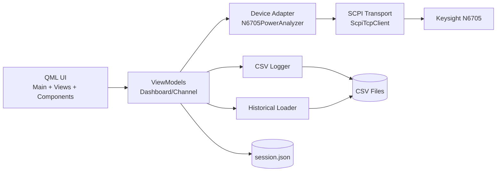
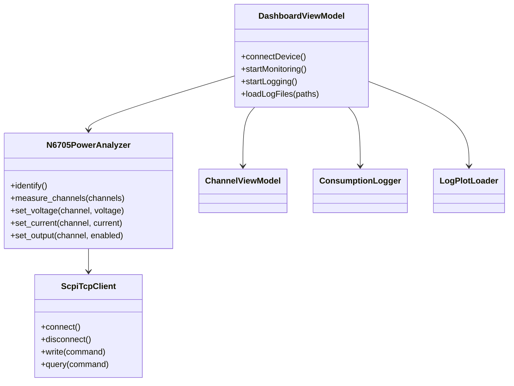
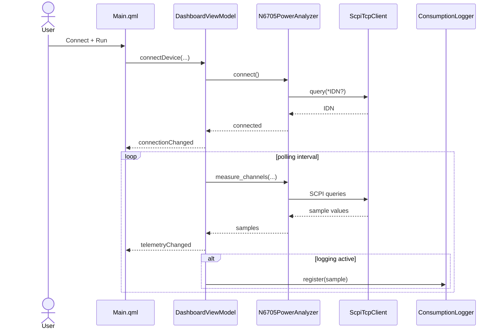

# UML and System Diagrams

Author: Mouhsine Kassimi Farhaoui  
Mail: mouhsine98@gmail.com

## Architecture Component Diagram

## Core Class Diagram

## Runtime Sequence (Simplified)

## PlantUML Source Files

- `docs/doxygen/uml/class_diagram.puml`
- `docs/doxygen/uml/runtime_sequence.puml`
- `docs/doxygen/uml/component_view.puml`
